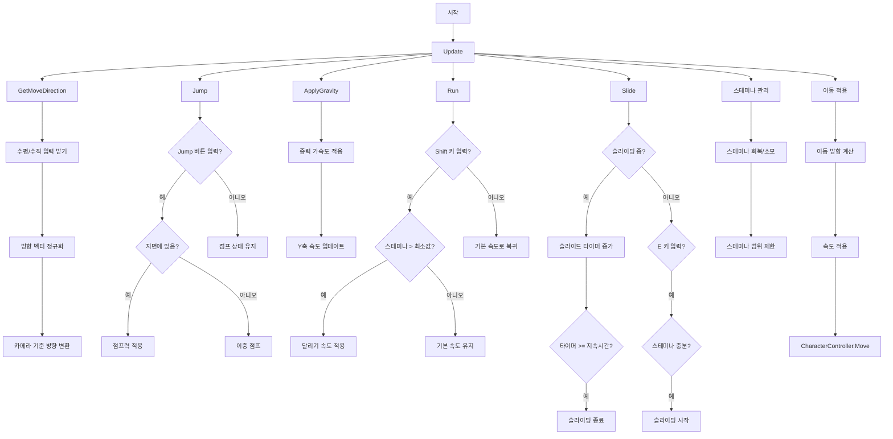

```mermaid
    flowchart TD
        A[시작] --> B[Update]
        B --> C[GetMoveDirection]
        B --> D[Jump]
        B --> E[ApplyGravity]
        B --> F[Run]
        B --> G[Slide]
        B --> H[스테미나 관리]
        B --> I[이동 적용]

        C --> C1[수평/수직 입력 받기]
        C1 --> C2[방향 벡터 정규화]
        C2 --> C3[카메라 기준 방향 변환]

        D --> D1{Jump 버튼 입력?}
        D1 -->|예| D2{지면에 있음?}
        D2 -->|예| D3[점프력 적용]
        D2 -->|아니오| D4[이중 점프]
        D1 -->|아니오| D5[점프 상태 유지]

        E --> E1[중력 가속도 적용]
        E1 --> E2[Y축 속도 업데이트]

        F --> F1{Shift 키 입력?}
        F1 -->|예| F2{스테미나 > 최소값?}
        F2 -->|예| F3[달리기 속도 적용]
        F2 -->|아니오| F4[기본 속도 유지]
        F1 -->|아니오| F5[기본 속도로 복귀]

        G --> G1{슬라이딩 중?}
        G1 -->|예| G2[슬라이드 타이머 증가]
        G2 --> G3{타이머 >= 지속시간?}
        G3 -->|예| G4[슬라이딩 종료]
        G1 -->|아니오| G5{E 키 입력?}
        G5 -->|예| G6{스테미나 충분?}
        G6 -->|예| G7[슬라이딩 시작]

        H --> H1[스테미나 회복/소모]
        H1 --> H2[스테미나 범위 제한]

        I --> I1[이동 방향 계산]
        I1 --> I2[속도 적용]
        I2 --> I3[CharacterController.Move]
```
